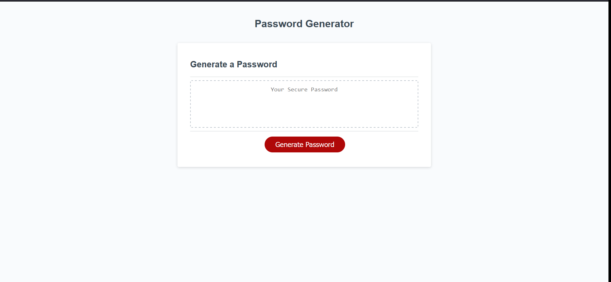

# Password-Generator
Application intended to  be used to create a random password based on user inputs.

## How to Use. 
- The random password generator will create a password of no less than 10 characters and no more than 80 characters. User must input at least a minimum of 4 lowercase letters, 4 uppercase letters, 1 number, and 1 symbol.
- Password generator will not accept non-integer inputs. 

## Purpose
- The generator is intended to create safe and completely randomized passwords. These passwords are accepted as the basic minimum requirements for many website. Including lowercase, uppercase, number, and symbol minimums.

## link to live website
 https://xyiorgyx.github.io/Password-Generator/

## link to github
https://github.com/xyiorgyx/Password-Generator

## Image

